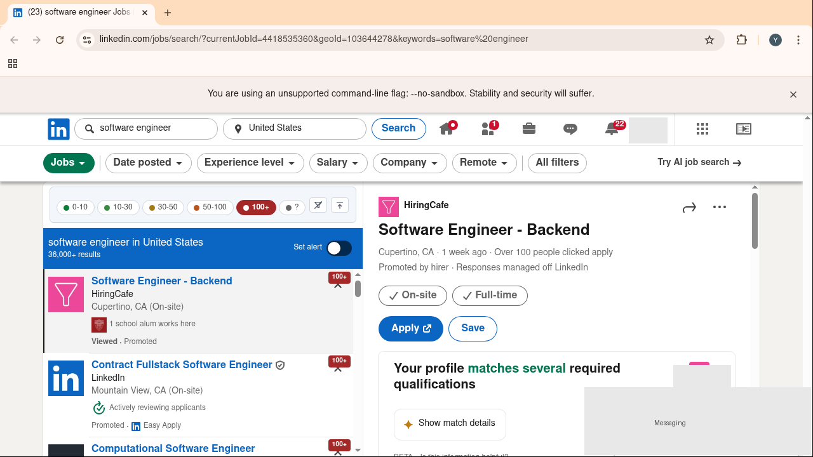
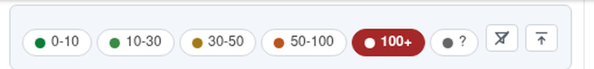

# LinkedIn Applicant Filter

> A Chrome extension that lets you filter LinkedIn job search results by
> precise applicant-count buckets — `0-10`, `10-30`, `30-50`, `50-100`, `100+`
> — instead of the single `<10 applicants` toggle LinkedIn ships natively.



> [!IMPORTANT]
> **Not affiliated with, endorsed by, or sponsored by LinkedIn.** This is an
> independent, non-commercial, personal-use project. It operates on pages your
> own logged-in browser loads. Automated access may conflict with LinkedIn's
> [User Agreement](https://www.linkedin.com/legal/user-agreement) (§8.2) and
> could put your account at risk. **Use at your own risk.** See
> [Known limits & honesty notes](#known-limits--honesty-notes).

---

## Table of contents

- [Why this exists](#why-this-exists)
- [What it does](#what-it-does)
- [Tech choices](#tech-choices)
- [Architecture](#architecture)
- [The decisions log](#the-decisions-log)
- [Performance](#performance)
- [Project layout](#project-layout)
- [Running locally](#running-locally)
- [Tests](#tests)
- [Known limits & honesty notes](#known-limits--honesty-notes)

---

## Why this exists

When you search jobs on LinkedIn, the only competition signal you get is a
single binary toggle: `Has under 10 applicants`. Anything else — 11, 30, 80,
"Over 100" — is collapsed into one undifferentiated mass. Job-seekers who
want to spend their effort on jobs they have a realistic chance at are flying
blind.

LinkedIn _does_ know per-job applicant numbers. They just don't expose them
to the search UI. This extension reaches into the page LinkedIn already loaded
and surfaces those numbers, one badge per card, with bucketed checkbox filters.

It's a small fix to a real, daily-felt pain point for anybody on LinkedIn's
job board.

---

## What it does



- The moment you land on `linkedin.com/jobs/search/*`, a filter bar appears
  above the result list with 6 buckets: `0-10`, `10-30`, `30-50`, `50-100`,
  `100+`, `?` (unknown).
- Within ~5 seconds (median), every visible card has a colored badge in its
  top-right corner — green = low competition, red = high.
- Check any bucket(s) to hide cards outside the selected range. Multi-select
  works. Click the funnel-strike icon to clear; the arrow-to-bar icon to
  collapse the bar (re-open by clicking the extension's toolbar icon).
- Your bucket selection and collapsed state persist across pages and
  browser restarts (via `chrome.storage.local`).
- Per-job applicant counts are cached for the browser session only
  (`chrome.storage.session` — cleared on browser close).

---

## Tech choices

| Layer                | Choice                                        | Why |
|----------------------|-----------------------------------------------|-----|
| Manifest             | **MV3**                                       | Mandatory for new Chrome Web Store submissions. |
| Frontend             | **Vanilla JS + CSS** (no framework)           | The whole extension is < 1k LOC. React/Vue would add 200KB+ of bundle for zero benefit. |
| Icons                | **Inline SVG** in markup, `currentColor` stroke | Crisp at any DPR, no font dependency, themable. |
| Selected pill state  | **CSS `:has(input:checked)`**                  | Chrome 105+ supports it natively — no JS toggle dance. |
| Data path            | **Two-source: Ember store + SSR HTML fetch**   | See [Architecture](#architecture). |
| Concurrency model    | **3 fetcher workers with per-worker jitter (1.5–3.5s)** | Mimics human burst-and-pause traffic, 3× throughput vs serial. |
| Backoff              | **Adaptive: drop to 1 worker + 8-15s jitter on 429/999** | Protects user's LinkedIn account if rate-limited. |
| Caches               | **`storage.session` for counts, `storage.local` for UI prefs** | Counts shouldn't outlive the session (data goes stale); prefs should. |
| Tests (unit)         | **Plain Node — no framework**                  | 42 cases in one self-contained file. CI is `node tests/test_parser.js`. |
| Tests (E2E)          | **Playwright + persistent Chrome profile**     | Real Chrome, real LinkedIn login, real extension load. |

---

## Architecture

```
                    ┌────────────────────────────────────────┐
                    │             LinkedIn page              │
                    │                                        │
   MAIN world ─┐    │ ┌──────────────┐    ┌───────────────┐  │
               │    │ │ window.Ember │    │ DOM (cards    │  │
               │    │ │ _global…cache│    │ with badges)  │  │
               │    │ └──────┬───────┘    └───────▲───────┘  │
               │    │        │                    │          │
               └─►main_world.js                   │          │
                  reads tertiaryDescription       │          │
                  posts via window.postMessage    │          │
                            ▼                     │          │
   ISOLATED ──┐  ┌──────────────────────────────────────┐    │
              │  │  content.js                          │    │
              │  │  • polls .scaffold-layout__list-item │    │
              │  │  • injects filter bar                │    │
              │  │  • paints colored badges             │    │
              │  │  • applies user filter (hide cards)  │    │
              │  └──┬─────────────────────────┬─────────┘    │
              │     │chrome.runtime.sendMsg   │              │
              │     ▼                         │              │
              │  JACF_ENQUEUE                 │JACF_RESULT   │
              │  JACF_EMBER_RESULT            │              │
              │     │                         │              │
   SW ───────────┐  │  ┌──────────────────────────────────┐  │
                 │  ▼  │ background.js (service worker)   │  │
                 │     │  • queue + 3 concurrent workers  │  │
                 │     │  • fetch /jobs/view/${id}/       │  │
                 │     │  • parser.js → bucket            │  │
                 │     │  • storage.session cache         │  │
                 │     │  • adaptive backoff on 429/999   │  │
                 │     └──────────────────────────────────┘  │
                 │                                            │
                 └────────────────────────────────────────────┘
```

**Why two data sources?**

1. **Ember store shortcut (`main_world.js` → SW)** — LinkedIn's own SPA
   pre-loads applicant text for *some* cards (mostly Promoted-by-hirer) into
   its in-memory Ember store at
   `urn:li:fsd_jobPostingCard:(JOBID,JOB_DETAILS).tertiaryDescription.text`.
   We sweep this every 1s and pipe matches to the SW. **Zero network cost,
   instant badges**.

2. **SSR HTML fetch (SW workers)** — For cards Ember didn't pre-load, we
   `fetch('https://www.linkedin.com/jobs/view/${jobId}/', {credentials:'include'})`
   from the SW. LinkedIn's server returns the applicant text embedded as a
   React Server Component data island in the initial HTML — no JS execution
   needed. A regex pulls it out. Throttled, jittered, capped.

The two paths feed the same `chrome.storage.session` cache, keyed by jobId,
and emit the same `JACF_RESULT` message to the content script. From the
content script's perspective, results just arrive.

**Two LinkedIn layouts.** LinkedIn A/B-tests two job-search surfaces:

- **Classic board** (`/jobs/search/`) — `.scaffold-layout__list` with
  `[data-job-id]` cards. The content script reads job IDs straight from the
  DOM.
- **AI / SDUI semantic search** (`/jobs/search-results/?origin=SEMANTIC_…`) —
  a React server-driven UI with **no Ember store, no `data-job-id`, no
  `/jobs/view/` links, and obfuscated hashed class names**. The only place
  each card's job ID lives is its **React fiber props**
  (`JobCardFrameworkImplDismissedState_{id}`). Since fiber props are
  page-set expandos invisible to an isolated-world content script, the
  MAIN-world `main_world.js` reads them and **stamps each card element with
  `data-jacf-jid="{id}"`** — a real DOM attribute, shared across worlds. The
  isolated content script then treats `[data-jacf-jid]` elements as cards and
  reuses every downstream path (fetch, badge, filter). To get the right card
  box (not a leaf node), it climbs from the id-bearing anchor up to the
  largest ancestor that doesn't merge another card's anchor.

  If we land on a surface we can't read at all, a dismissible fallback notice
  tells the user instead of failing silently (see Resilience).

**Why polling and not MutationObserver?** LinkedIn's list virtualizes
aggressively — observer callbacks frequently fire before the new card has
its `data-job-id` attribute set, and the observer can starve on rapid
updates. A 1-second `setInterval` with a seen-set short-circuit is dead simple
and idle ticks cost nothing.

**Why no card-level loading badges?** An earlier iteration painted a gray
pulsing `···` badge on every queued card to give immediate feedback. User
feedback (real user, not hypothetical): _"don't intrude on LinkedIn's UI"_.
All loading state moved into our own filter-bar area — a slim 2px green
progress line at the bottom of the bar, plus a `已标 3/7 · 约 8s` text that
disappears when idle.

---

## The decisions log

This started as "filter LinkedIn jobs by applicant count" and ended up being
a 16-hour investigation into LinkedIn's data architecture before a single
production line of code was written. The interesting decisions, in order:

### 1. Where does the data live?

We surveyed three candidates with probe scripts (see `probes/`):

| Path | Verdict |
|------|---------|
| `urn:li:fsd_jobApplicantInsights:JOBID.applicantCount` (the schema-shaped field) | ❌ Always `null` — paywalled behind LinkedIn Premium for non-Premium accounts. |
| `urn:li:fsd_jobPostingCard:(JOBID,JOB_DETAILS).tertiaryDescription.text` (free-text) | ✅ Populated, but only for Promoted-by-hirer cards (~30%). |
| `fetch('/jobs/view/${id}/')` SSR HTML | ✅ Populated for **every** card with a precise/range count, in the initial server-rendered HTML. |

### 2. How do we get it without burning the user's account?

The fetch is the workhorse. LinkedIn TOS prohibits automated traffic, so the
risk profile drives the throttling:

- **3 concurrent workers** (vs 1) — aggregate ≈ 1.2 req/s, still within human
  burst patterns (humans open 2-3 tabs in quick succession).
- **Per-worker jitter 1.5-3.5s** with no shared barrier — looks like a
  human's irregular click rhythm.
- **Adaptive backoff** — on the first 429/999, drop to 1 worker + 8-15s
  jitter. A second 429 hard-stops the session.
- **Hard cap 100 fetches per browser session** — protects against a runaway
  loop or pathological queries.

### 3. Why not just hit LinkedIn's voyager batch API?

It exists, returns JSON, and could give us all 25 cards in one call. But
that path requires extracting a CSRF token from cookies, calls a private
endpoint, and is unmistakably "scraping" from LinkedIn's perspective. The
SSR-HTML approach looks identical to a tab open. We stay on it.

### 4. Storage split

- `chrome.storage.session` for fetched applicant counts. They go stale fast
  (a "4 people clicked apply" job becomes "47 people clicked apply" in
  hours), and the user explicitly didn't want permanent caching.
- `chrome.storage.local` for UI preferences (which buckets are checked,
  collapsed state). These should survive browser restarts.

### 5. Performance journey

| | Avg | Median | Max | What changed |
|--|---|---|---|---|
| **v1 baseline** | 12.9s | 9.2s | 36.4s | Single worker, 2.5s avg jitter, no Ember shortcut. |
| **v2 (broken)** | 15.1s | 14.7s | 30.5s | Concurrency + Ember _coded_ but **Chrome was running cached SW bytecode from v1**. The cache lives in `~/.chrome-profile/Default/Service Worker/ScriptCache/` and isn't invalidated by mtime or manifest version bumps. Smoking-gun debug: `typeof self.__jacfStats === 'undefined'` despite the line being on disk. |
| **v3 (fixed)** | **5.9s** | **5.8s** | **6.5s** | `install_extension.py` now wipes `Service Worker/ScriptCache + Database` on every install. Concurrency + Ember now actually run. **54% faster than v1, max-case 82% faster.** |

The v2 → v3 cache bug is the kind of thing you only find by writing a
diagnostic that reads `self.__jacfStats` from a Playwright-attached SW. It
would have been invisible to "I edited the file, why doesn't it work."

### 6. Pages 2/3 don't degrade

A natural worry was: pages with fewer Promoted cards (so fewer Ember
shortcut hits) would slow down. They didn't —
[the cross-page benchmark](tests/test_perf_pages.py) showed page 1, 2, and 3
all average ~6s. The 3-worker fetch path picks up exactly the slack the
Ember shortcut leaves. ([raw data](#performance))

### 7. UI iterations

The filter bar went through 5 visual iterations driven by direct user
feedback:

- v1: too wide (didn't fit LinkedIn's narrow list pane).
- v2: forced to one line with horizontal scrollbar (clear + collapse hidden
  off-screen).
- v3: bumped font to 13px — became too wide again.
- v4: dropped to 12px, hid the "人数" title, dropped per-pill count badges,
  replaced "清除" text with × char.
- v5 (current): SVG icons for clear ("filter with slash") + collapse
  ("up-arrow-to-bar"), `flex-wrap: wrap` instead of scrollbar, **selected
  state = pill fills with bucket color + white text** (was: just bold).

---

## Performance

Measured by `tests/test_perf.py` against 10 different keyword searches
against real LinkedIn, fresh-session each time. See the
[v1 → v3 table above](#5-performance-journey).

Pages 2/3 measured by `tests/test_perf_pages.py` — 3 keywords × 3 pages = 9
runs. **No degradation on later pages.**

```
page 1  avg=6.13s   ember 33% · fetch 48% · missing 19%
page 2  avg=6.32s   ember 38% · fetch 48% · missing 14%
page 3  avg=6.06s   ember 57% · fetch 43% · missing  0%
```

---

## Project layout

```
.
├── manifest.json              # MV3 declaration
├── parser.js                  # regex + bucket logic, dual-export (Node + browser)
├── background.js              # SW: queue + 3 workers + adaptive backoff
├── content.js                 # ISOLATED world: DOM + UI + filter bar
├── main_world.js              # MAIN world: Ember store sweep
├── content.css                # filter bar + badges
├── icon/                      # 16/48/128 px PNGs
├── tests/
│   ├── test_parser.js         # 42 Node unit tests
│   ├── test_e2e.py            # 8 Playwright E2E tests
│   ├── test_perf.py           # 10-keyword nav→done benchmark
│   ├── test_perf_pages.py     # cross-page benchmark (Ember vs fetch split)
│   └── install_extension.py   # programmatic install for headless E2E
├── probes/                    # the 8 investigation scripts that led to the design
├── docs/screenshots/          # README assets
└── .github/workflows/ci.yml   # parser-test CI
```

---

## Running locally

### Install in your own Chrome

1. Clone or download this repo.
2. Open `chrome://extensions/` in Chrome.
3. Turn on **Developer mode** (top-right toggle).
4. Click **Load unpacked** and select this folder.
5. Navigate to any `linkedin.com/jobs/search/*` page. Bar appears in ~5s.

### Developer setup (headless E2E)

The E2E and perf suites run in a Linux container with an Xvfb display so
Chrome can run headed-ish with a real persistent profile (logged into
LinkedIn). See `~/BROWSER_STACK.md` notes for that setup.

```bash
# Unit tests (no browser)
node tests/test_parser.js                       # 42 / 42

# E2E (needs the Xvfb stack + persistent profile)
pytest tests/test_e2e.py -v                     # 8 / 8

# Perf benchmark (~12 min)
pytest tests/test_perf.py -v -s
```

---

## Tests

| Suite | Where | Count | Runs in CI |
|---|---|---|---|
| Parser unit tests | `tests/test_parser.js` | 42 | ✅ |
| E2E (Playwright + real LinkedIn) | `tests/test_e2e.py` | 8 | ❌ (needs LinkedIn login) |
| Perf benchmark | `tests/test_perf.py` | 1 | ❌ (12 min, real LinkedIn) |
| Cross-page perf | `tests/test_perf_pages.py` | 1 | ❌ (real LinkedIn) |

---

## Known limits & honesty notes

- **LinkedIn TOS.** Section 8.2 of LinkedIn's User Agreement broadly
  prohibits automated access. The extension fetches the user's own
  authenticated `/jobs/view/${id}/` pages — the same URL their browser
  would hit. We throttle aggressively (~1.2 req/s aggregate, max 100/session)
  and back off on rate-limit signals, but the LinkedIn account risk is
  non-zero. Personal-use only is the honest framing.
- **The `applicantCount` field is paywalled.** Even with Premium our probes
  didn't surface it. We work around by parsing the SSR HTML's prose
  ("Over 100 applicants", "4 people clicked apply", "Be among the first 25
  applicants"). Coverage is high but the values are LinkedIn's choice of
  presentation — "Over 100" is the upper cap, exact numbers go up to ~99.
- **Bucket of "unknown"** (`?`) means we couldn't extract a count from the
  HTML (either the page didn't render one or the regex missed a new format).
  Tagged distinctly from "100+".
- **No Firefox / Safari port.** MV3, `chrome.storage.session`,
  `world: "MAIN"` content scripts — these are Chromium-shaped.

---

## License

MIT. See [LICENSE](LICENSE).
